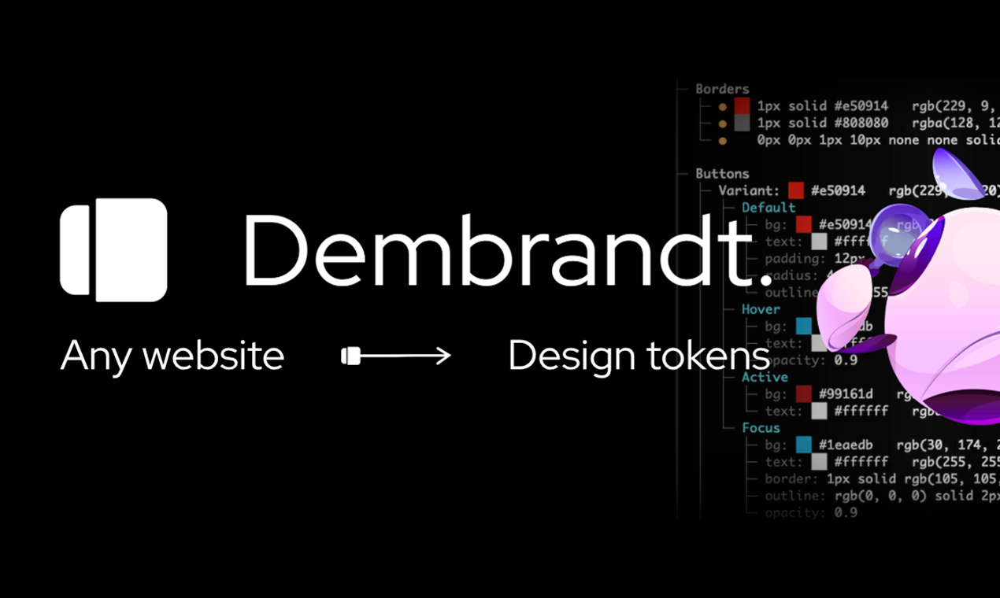

Generate design tokens from any website instantly. Free and open source, trusted by 1,500+ developers.

```bash
npm install -g dembrandt@latest

dembrandt bmw.de
```

### [Dembrandt](https://github.com/dembrandt/dembrandt)
Extract colors, typography, spacing, shadows, and logos. Outputs W3C design tokens for Figma, Tailwind, PDF, or any design system.

[](https://www.npmjs.com/package/dembrandt) [](https://github.com/dembrandt/dembrandt) [](https://x.com/dembrandtcom)

### [DTCG Validator](https://github.com/dembrandt/dtcg-validator)
Real-time validator for W3C Design Tokens Community Group format. Supports all 13 token types, aliases, and circular reference detection.

### [Awesome-Sole-Creator](https://github.com/dembrandt/awesome-sole-creator)
25 years in design, dev, branding and marketing. Tools that actually work. Mac and CLI focused.

[](https://github.com/dembrandt/dtcg-validator)

---

[dembrandt.com](https://dembrandt.com) · [LinkedIn](https://www.linkedin.com/company/10303168/) · [X](https://x.com/dembrandtcom)
